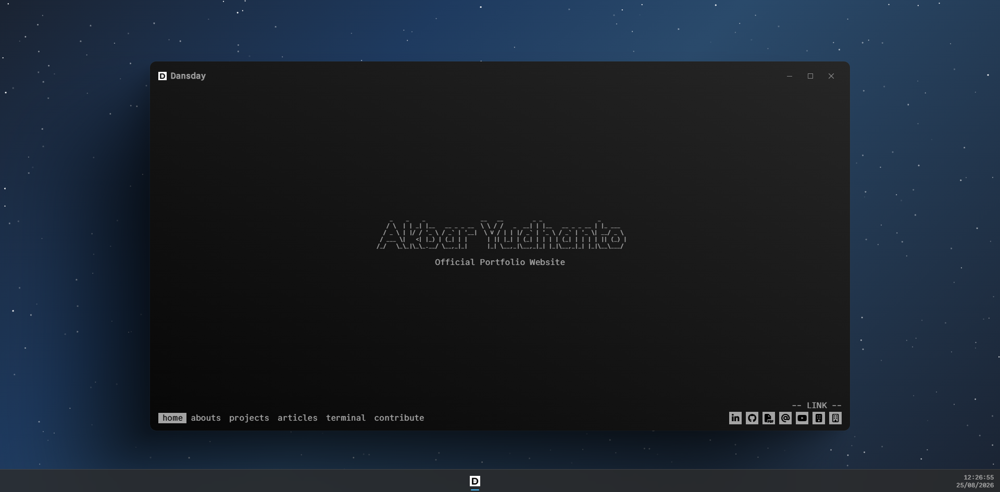
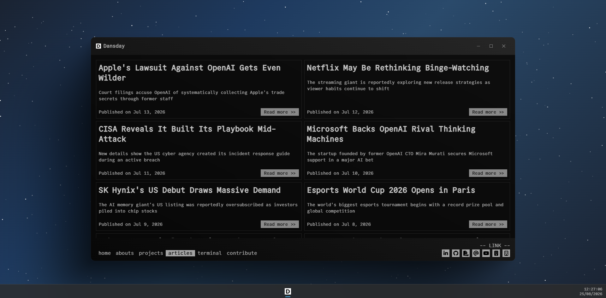
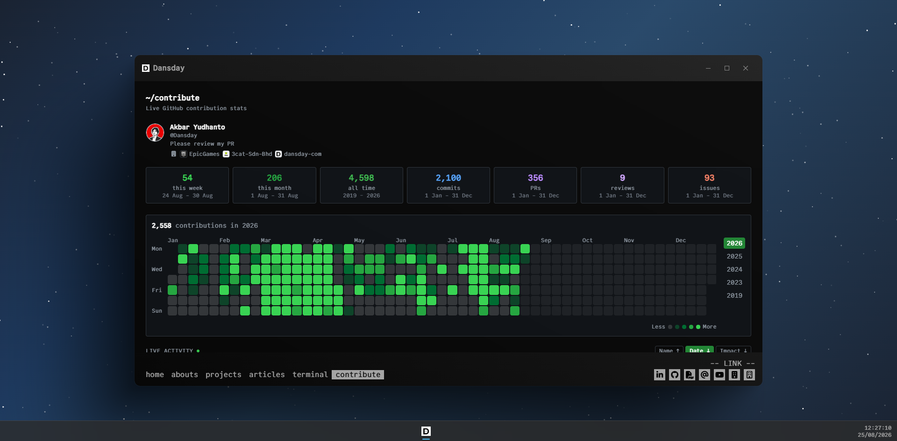
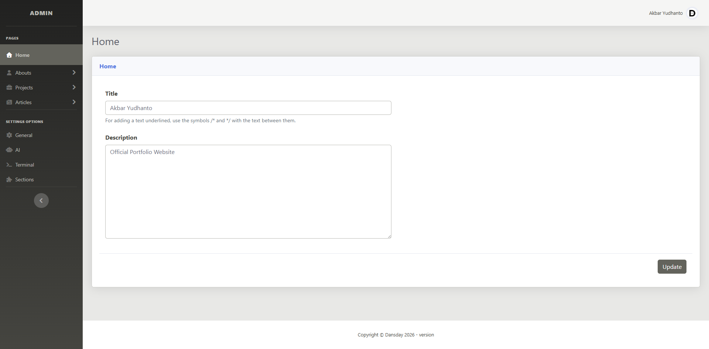
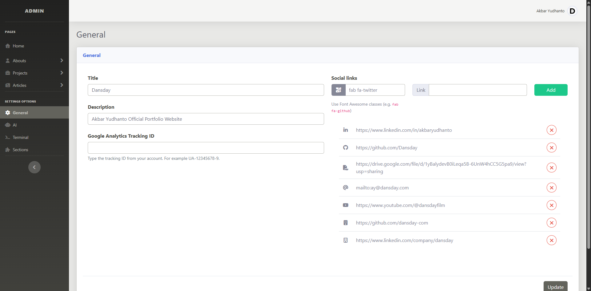

# &lt;/DANSDAY&gt; Personal Site

A portfolio site that looks like a terminal, and the Laravel panel that runs it. Articles, projects, an about page and live GitHub stats — plus an MCP endpoint so an AI assistant writes and edits your content for you. Self-host from GitHub. MIT licensed.



<table>
<tr>
<td width="50%"></td>
<td width="50%"></td>
</tr>
<tr>
<td><strong>Articles</strong> — cards with summary and publish date, filtered by category, sorted server side.</td>
<td><strong>Contribute</strong> — live GitHub stats: commits, PRs, reviews, issues and a contribution heatmap per year.</td>
</tr>
</table>

### The panel

<table>
<tr>
<td width="50%"></td>
<td width="50%"></td>
</tr>
<tr>
<td><strong>Pages</strong> — one screen per section: home, abouts, projects, articles.</td>
<td><strong>Settings</strong> — site metadata, analytics, social links, AI providers and section toggles.</td>
</tr>
</table>

---

## Features

### Public site (`main`)

- **Articles and projects** with categories, per-item visibility and SEO metadata
- **About page** built from skills, experience, services and testimonials — each reorderable
- **Terminal** page that answers questions from your own content using semantic search
- **Contribute** page backed by cached GitHub activity
- Sitemap and `robots.txt` generated from live content

### Admin panel (`admin`)

- Full CRUD for every section of the site, WYSIWYG bodies, optional images
- Section toggles that show or hide whole blocks of the site
- Social links, analytics ID and site metadata in one place
- Panel translations for **18 locales**
- **MCP server** — see [MCP server](#mcp-server)

### AI

- **Article and project generation** against any OpenAI-compatible endpoint, with tool calling so the model searches your existing work before writing
- **Hybrid retrieval** — MySQL full-text (BM25) fused with embedding similarity via reciprocal rank fusion
- A background **embedding worker** keeps the index current
- Provider, model, prompts and reasoning effort are set in the panel, not `.env`

---

## Tech stack

| Area               | Technologies                                                                                     |
| ------------------ | ------------------------------------------------------------------------------------------------ |
| Frontend           | [SvelteKit](https://kit.svelte.dev/), [Svelte](https://svelte.dev/), [Vite](https://vitejs.dev/)  |
| Language           | [TypeScript](https://www.typescriptlang.org/)                                                    |
| Styling            | [Tailwind CSS](https://tailwindcss.com/) (site), SCSS + Bootstrap (panel)                        |
| Backend            | [Laravel 12](https://laravel.com/) (PHP 8.5+) on [FrankenPHP](https://frankenphp.dev/)            |
| Database           | [MySQL](https://www.mysql.com/), shared by both apps                                             |
| Cache / sessions   | [Redis](https://redis.io/)                                                                       |
| AI providers       | Any OpenAI-compatible chat and embeddings endpoint                                               |
| AI tooling         | [Model Context Protocol](https://modelcontextprotocol.io)                                        |
| Observability      | [OpenTelemetry](https://opentelemetry.io/)                                                       |
| Infrastructure     | [Docker](https://www.docker.com/), [Docker Compose](https://docs.docker.com/compose/)             |

---

## Getting started

MySQL and Redis are **not** in the Compose stack — point the environment variables at your own.

```bash
cp .env.example .env   # set DB_* and REDIS_*
make up                # build and start both services
make down              # stop
```

The admin container runs `php artisan migrate --force` on start. Both services expect a reverse proxy in front, routing by domain or path.

### Local development

```bash
make install                    # deps for both apps, copies .env files

cd admin && composer setup      # key:generate, migrate, npm build
composer dev                    # serve + queue + logs + vite

cd ../main && npm run dev       # http://localhost:5173
```

The panel seeds itself on first visit. Register the first user at `/register`.

---

## Configuration

| Variable                                                  | Used by | What it does                                    |
| --------------------------------------------------------- | ------- | ----------------------------------------------- |
| `APP_KEY`                                                 | admin   | Laravel encryption key — generate, never share  |
| `DB_HOST` / `DB_DATABASE` / `DB_USERNAME` / `DB_PASSWORD`  | both    | Shared MySQL connection                         |
| `REDIS_HOST` / `REDIS_PORT` / `REDIS_PASSWORD`             | admin   | Cache, queues and sessions                      |
| `REDIS_SOCKET`                                            | admin   | Use instead of host/port on socket-based hosting |
| `BASE_URL`                                                | main    | Public site origin, for canonical URLs          |
| `ADMIN_PUBLIC_URL`                                        | main    | Where uploaded images are served from           |

AI provider URLs, keys, models and prompts live in the panel under **Settings → AI**, stored in the database.

---

## MCP server

`POST /mcp` speaks [Model Context Protocol](https://modelcontextprotocol.io), so an AI client can write an article, backdate it, reorganise categories or reorder the about page.

### 1. Mint a token

```bash
cd admin
php artisan migrate
php artisan mcp:token "claude-code"      # printed once, stored as a SHA-256 hash
php artisan mcp:token --list
php artisan mcp:token --revoke=1
```

### 2. Check it is reachable

```bash
curl -sS https://admin.example.com/mcp \
  -H "Authorization: Bearer mcp_live_..." \
  -H "Content-Type: application/json" \
  -d '{"jsonrpc":"2.0","id":1,"method":"tools/list"}'
```

> The endpoint sits at the domain root, not under `/admin`. If your proxy routes the panel by path prefix, add a `/mcp` rule or move the route in `admin/routes/mcp.php`.

### 3. Connect a client

```bash
claude mcp add --transport http dansday https://admin.example.com/mcp \
  --header "Authorization: Bearer mcp_live_..."
```

Clients that require OAuth rather than a static bearer token need a bridge such as `mcp-remote` to inject the header.

### Tools

| Area               | Tools                                                                                                                                                                                       |
| ------------------ | ------------------------------------------------------------------------------------------------------------------------------------------------------------------------------------------- |
| Articles           | `list_articles`, `get_article`, `create_article`, `update_article`, `delete_article`                                                                                                          |
| Projects           | `list_projects`, `get_project`, `create_project`, `update_project`, `delete_project`                                                                                                          |
| Article categories | `list_article_categories`, `create_article_category`, `update_article_category`, `delete_article_category`                                                                                    |
| Project categories | `list_project_categories`, `create_project_category`, `update_project_category`, `delete_project_category`                                                                                    |
| Abouts             | `list_abouts`, `create_skill`, `update_skill`, `create_experience`, `update_experience`, `create_service`, `update_service`, `create_testimonial`, `update_testimonial`, `delete_about`, `reorder_about` |
| Pages              | `get_home_page`, `update_home_page`, `get_sections`, `update_sections`                                                                                                                        |

- Bodies are **HTML**. Creating an article or project needs an existing category — call `list_*_categories` first.
- **`created_at` is writable** on create and update. That is how posts get backdated.
- **Images are optional.** Pass an absolute URL or a path under `uploads/img/`; anything else is rejected. Binary upload is not on the tool surface — upload in the panel, reference the path.
- Every write keeps the **embeddings index** in sync.
- Deleting a category is refused while any article or project still uses it.
- Disabled sections are excluded from AI recall as well as the site.

Token handling and the HTML sanitising rules are in [SECURITY.md](SECURITY.md#mcp-tokens).

---

## Project layout

| Path                  | What lives there                                          |
| --------------------- | --------------------------------------------------------- |
| `main/src/routes`     | Public pages and API routes                               |
| `main/src/lib/server` | Server-only data access — MySQL, Redis, query helpers     |
| `admin/app/Http`      | Panel controllers and middleware                          |
| `admin/app/Services`  | AI generation, embeddings, content writes                 |
| `admin/app/Mcp`       | MCP tool definitions and registry                         |
| `admin/routes`        | `web.php`, `mcp.php`, `console.php`                       |

Fuller table and the review checklist: [CONTRIBUTING.md](CONTRIBUTING.md#project-layout).

---

## Contributing

Issues and pull requests welcome — [CONTRIBUTING.md](CONTRIBUTING.md). By taking part you agree to the [Code of Conduct](CODE_OF_CONDUCT.md).

## Security

Found a vulnerability? Email **security@dansday.com** instead of opening an issue — [SECURITY.md](SECURITY.md).

## License

[MIT](LICENSE) · Author: Akbar Yudhanto · Version: 2.4.0
